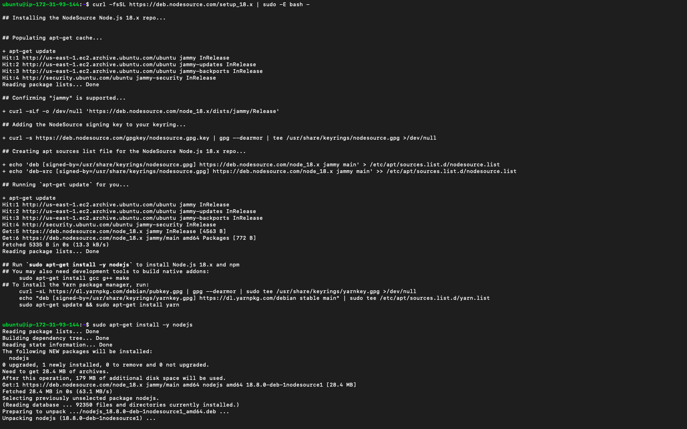
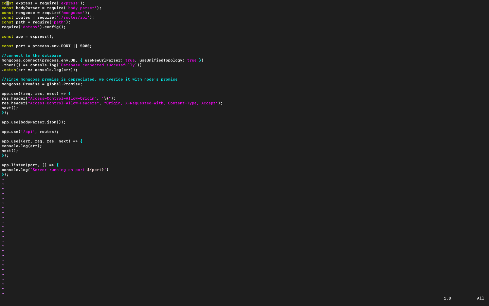
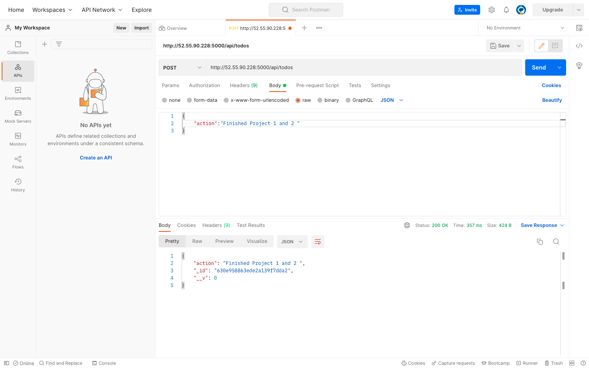
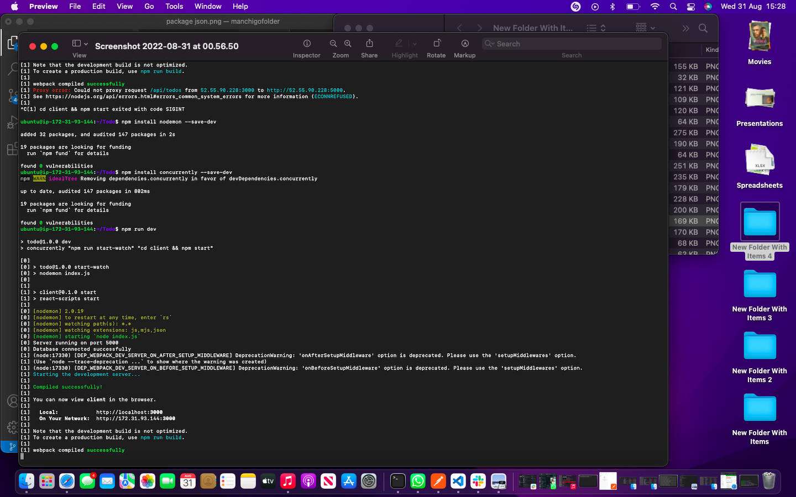

#  SIMPLE TO-DO APPLICATION ON MERN WEB STACK
In this project, you are tasked to implement a web solution based on MERN stack in AWS Cloud.

MERN Web stack consists of following components:

MongoDB: A document-based, No-SQL database used to store application data in a form of documents.
ExpressJS: A server side Web Application framework for Node.js.
ReactJS: A frontend framework developed by Facebook. It is based on JavaScript, used to build User Interface (UI) components.
Node.js: A JavaScript runtime environment. It is used to run JavaScript on a machine rather than in a browser.
## Preparing prerequisites
Creating a new EC2 instance of t2.nano family with Ubuntu Server 20.04 LTS (HVM) image.
## BACKEND CONFIGURATION
`sudo apt update` to update Ubuntu OS

`sudo apt upgrade` to upgrade Ubuntu OS

`curl -fsSL https://deb.nodesource.com/setup_18.x | sudo -E bash -' to get the location of Node.js software from Ubuntu repositories`

`sudo apt-get install -y nodejs' to install Node.js on the server`

The command above installs both nodejs and npm. NPM is a package manager for Node like apt for Ubuntu, it is used to install Node modules & packages and to manage dependency conflicts.
To Verify the node installation with the command below
`node -v` 
`npm -v`

### Application Code Setup
Creating a new directory for your To-Do project.
`mkdir Todo`
`ls` to verify that the Todo directory is created
changing current directory to the newly created one.
`cd Todo`
 you will use the command npm init to initialise your project, so that a new file named package.json will be created. This file will normally contain information about your application and the dependencies that it needs to run. Follow the prompts after running the command. You can press Enter several times to accept default values, then accept to write out the package.json file by typing yes.

`npm init`
`ls` to confirm package.json file was created

## INSTALLing EXPRESSJS
Express helps to define routes of application based on HTTP methods and URLs.
`npm install express`
`touch index.js`- to create index.js file.
`ls` to confirm created index.js file

`npm install dotenv` to Install the dotenv module
`vim index.js` to input codes and using :w to save in vim and :qa to exit vim

`node index.js` to start server
opening port 5000 in EC2 security group
Express page loaded

### creating routes that will define various endpoints that the To-do app will depend on.
`mkdir routes`
`cd routes`
`touch api.js`
`vim api.js` to input codes and using :w to save in vim and :qa to exit vim

###since the app is going to make use of Mongodb which is a NoSQL database, we need to create a model.
create a Schema and a model, install mongoose which is a Node.js package that makes working with mongodb easier.

Changing directory back Todo folder with cd and install Mongoose

`npm install mongoose`
`mkdir models`
`cd models`
`touch todo.js`

`vim todo.js` to input code

`vim api.js` in Routes folder(editing codes)

## Storing data using MONGODB DATABASE
Following the sign up process and select AWS as the cloud provider, and choosing a region near me.
Create a file in your Todo directory and name it .env.

`touch .env`
`vi .env`
Add the connection string to access the database in it, just as below:

`DB = 'mongodb+srv://<username>:<password>@<network-address>/<dbname>?retryWrites=true&w=majority'
update the index.js to reflect the use of .env so that Node.js can connect to the database`

Start your server using the command:
`node index.js`

In this project, we will use Postman to test our API.
 Installing Postman
create a POST request to the API http://<PublicIP-or-PublicDNS>:5000/api/todos. This request sends a new task to our To-Do list so the application could store it in the database.

Note: make sure your set header key Content-Type as application/json
Create a GET request to your API on http://<PublicIP-or-PublicDNS>:5000/api/todos. This request retrieves all existing records from out To-do application (backend requests these records from the database and sends it us back as a response to GET request).

## FRONTEND CREATION
`npx create-react-app client` in Todo folder
client folder created 
Install concurrently. It is used to run more than one command simultaneously from the same terminal window.
`npm install concurrently --save-dev`
Install nodemon. It is used to run and monitor the server. If there is any change in the server code, nodemon will restart it automatically and load the new changes.
`npm install nodemon --save-dev`

editing  package.json file In Todo folder.
Configure Proxy in package.json

Change directory to ‘client’
`cd client`
Open the package.json file
`vi package.json`
Add the key value pair in the package.json 
file "proxy": "http://localhost:5000".

`npm run dev` in Todo folder

## Creating your React Components
`cd client`
`cd src`
`mkdir components`
`cd components`
`touch Input.js ListTodo.js Todo.js`

`vi Input.js` inputing code
moving to client using 'cd  client
`npm install axios`

`cd  src/components`
`vi ListTodo.js` inputing code
`vi Todo.js` inputing code
Editing code to delete logo
in src folder..`vi App.js` and `vi App.css`
`cd Todo`
`npm run dev`

To-Do app loaded 

..end of project3..

